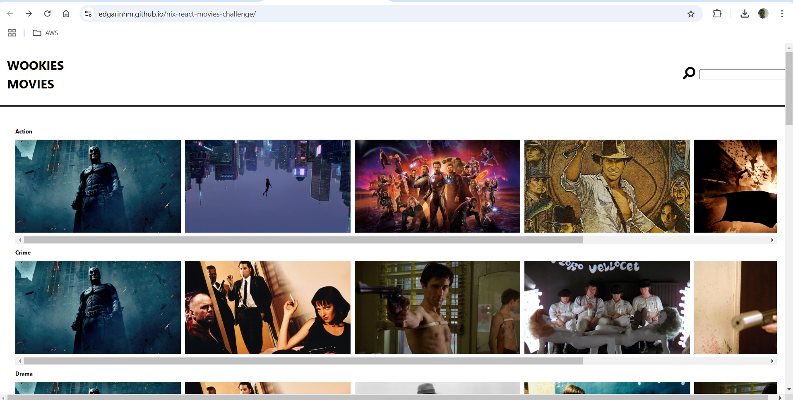

### Objective

Your assignment is to implement a movie streaming dashboard using JavaScript and React.

### Demo
* stage: https://edgarinhm.github.io/nix-react-movies-challenge

### Screenshot

### Tasks

-   Implement assignment using:
    -   Language: **JavaScript**
    -   Framework: **React**
-   Build out the project to the designs inside the `/Designs` folder
-   Connect your application to the **Movie Database** at `https://xxx/movies`
-   Parse the API response and display the results as outlined in the design. **Make sure to group movies by categories**.
-   Implement a detail view for the movies in the list
-   Make sure that inking to detail pages as well as bookmarking works as expected
-   Implement search by connecting to `https://xxx/movies?q=<search_term>`

### Deliverables

Make sure to include all source code in the repository. 

### Evaluation Criteria

-   **JavaScript** best practices
-   We're looking for you to produce working code, with enough room to demonstrate how to structure components in a small program.
-   Show us your work through your commit history
-   Completeness: did you complete the features?
-   Correctness: does the functionality act in sensible, thought-out ways?
-   Maintainability: is it written in a clean, maintainable way?
-   Testing: is the system adequately tested?